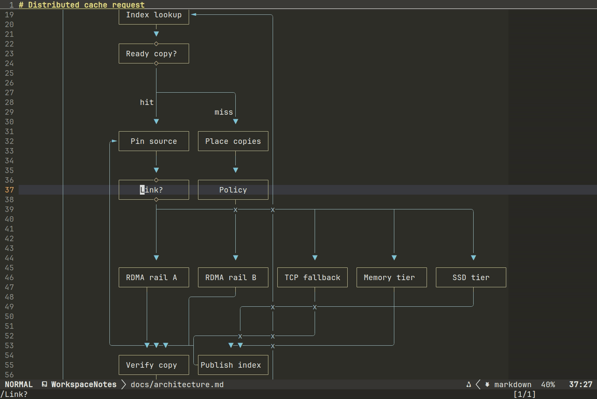

# BeckNvim

BeckNvim is a project-oriented Neovim configuration focused on navigation, semantic search, Git
inspection, language tooling, and readable code review. Its features share a consistent visual
system while keeping native Neovim and plugin behavior wherever practical.

## Highlights

- **Symbol search:** find functions and types across a project, explore source previews, and jump to definitions.
- **Git review:** search remote branches, inspect commits, detach HEAD for deeper review, and read pull requests in floating dialogs.
- **Markdown and Mermaid:** read tables and complex diagrams that adapt to the pane width, with source editing in place and refreshes when external file changes are detected. Use `gx` on prose or table links to open files relative to the source document.
  Use `<Space>o` / `<Space>p` to jump back and forward through rendered documents within the current Neovim run.
  Mermaid render failures show a single-line warning and leave the source readable and editable.
- **Project workspace:** browse recent projects and files from the homepage, with live [light and dark theme previews](themes/README.md).
  Inside tmux, its local palette hook makes the pane and status bar follow the editor theme;
  see [tmux theme integration](docs/architecture.md#tmux-theme-integration).

## See it in action

**Symbol search:** use `<Space>fw` to explore functions and types across Mooncake.


**Git review:** search a remote branch, review a detached commit, and open a pull request in a float.


**Markdown:** a complex Mermaid diagram reflows as the pane narrows, with source editing in place.



**Homepage and themes:** browse recent projects and files, then preview light and dark palettes.


Regenerate these demos with `bash scripts/record-demos.sh`.
See [Recording the highlights](examples/README.md) for setup and individual scenes.

## Main Modules

| Module | Main responsibility |
| --- | --- |
| `config/startup/` | Editor options, autocmds, keymap assembly, and plugin bootstrap |
| `config/project.lua` | Project-root discovery, activation, containment, and cached project state |
| `config/ui/` | Theme selection and palette, dashboard, file tree, statusline, terminal, shared floats, and window state |
| `config/search/` | Telescope configuration, project search, previews, and LSP location results |
| `config/git/` | Git history workflows, Diffview lifecycle, repository data, and GitHub details |
| `config/lsp/` | Language-server setup, completion, diagnostics, and type-information views |
| `config/syntax/` | Tree-sitter setup, Markdown rendering, folds, highlights, and syntax context |
| `config/type_hierarchy/` | Recursive class hierarchy and implementation discovery |
| `config/python/` | Python environment resolution and hierarchy indexing |
| `config/network/` | Proxy discovery, persistent session state, and proxy selection UI |
| `config/translation/` | Translation interface, provider construction, and response parsing |
| `config/audit/` | Project-wide diagnostic collection and audit coordination |
| `plugins/` | Plugin declarations, dependencies, loading conditions, and setup |

The complete ownership and lifecycle model is documented in
[Architecture](docs/architecture.md).

## Installation

Back up any existing `~/.config/nvim` directory, then run:

```bash
git clone https://github.com/BeckWlim/BeckNvim.git ~/.config/nvim
cd ~/.config/nvim
./setup.sh
```

Setup installs missing external tools and reuses compatible ones already installed. Follow any
PATH instructions it prints, reopen your terminal, and start Neovim:

```bash
nvim
```

On first launch, lazy.nvim installs missing plugins and builds Termaid for Mermaid diagrams;
Mason installs configured language servers.

Run `./setup.sh --check` to check dependencies or `./setup.sh --help` for setup options.

To load plugins from local checkouts, configure [development mode](docs/development.md#local-plugin-development)
in `~/.nvim`.

## Documentation

- [Default keybindings](docs/keybindings.md)
- [Git mode](docs/git-mode.md)
- [Architecture](docs/architecture.md)
- [Development and validation](docs/development.md)

## License

Licensed under the [MIT License](LICENSE).
