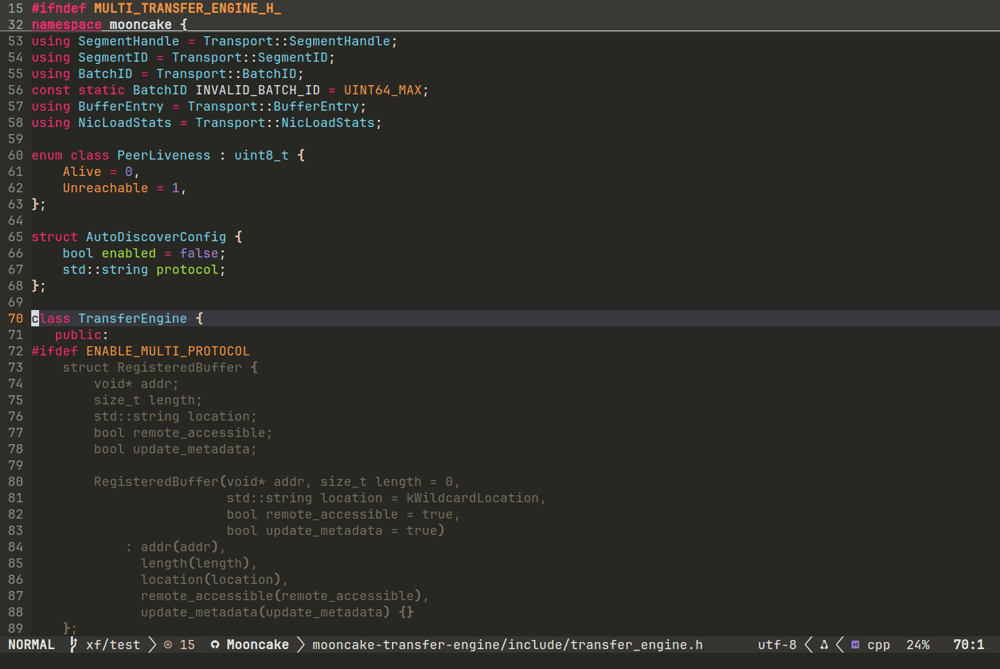
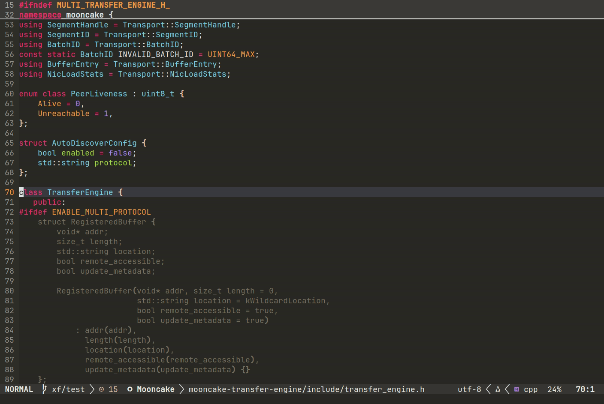
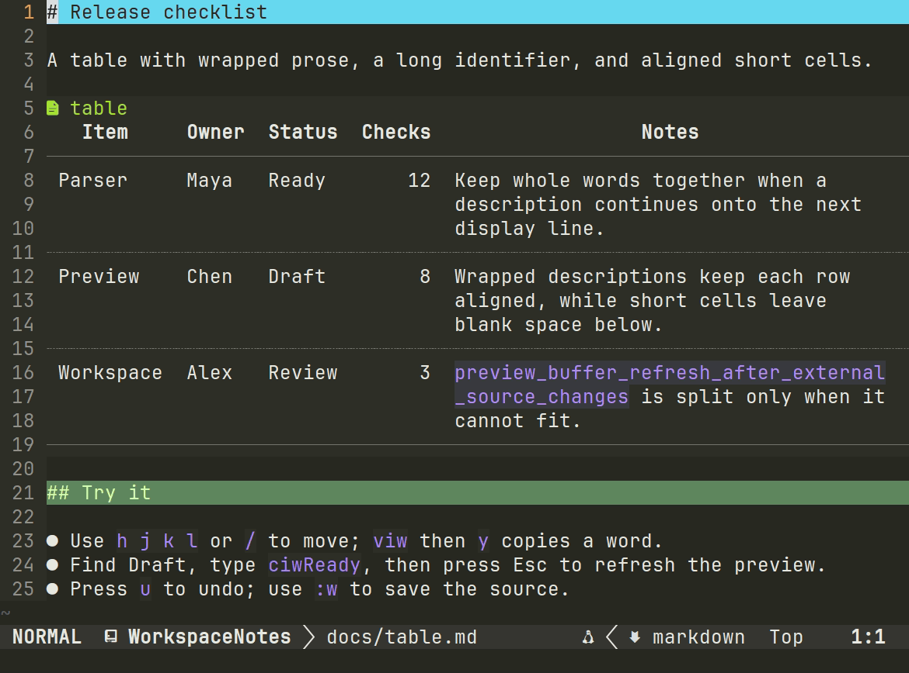
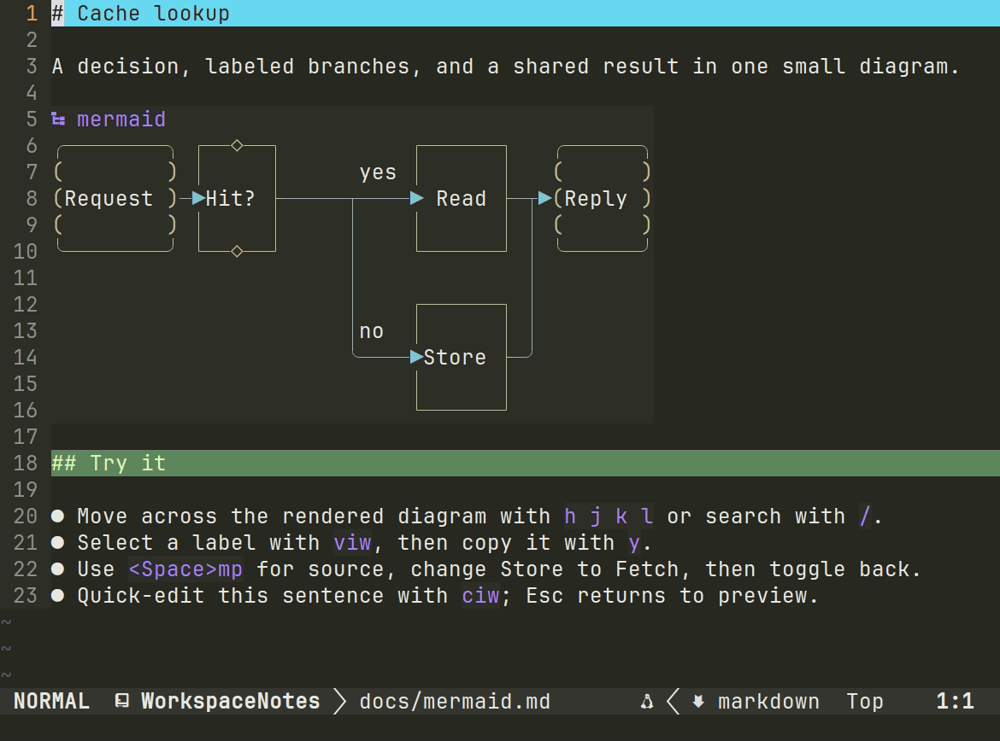
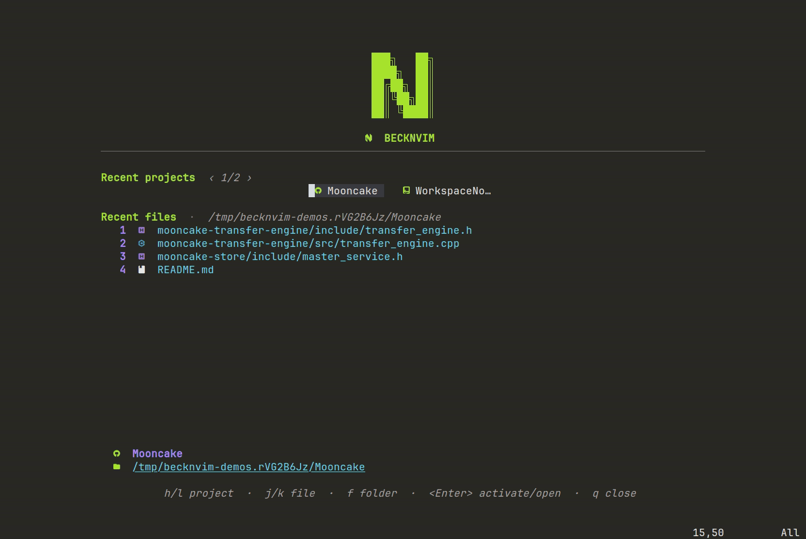

# BeckNvim

BeckNvim is a project-oriented Neovim configuration focused on navigation, semantic search, Git
inspection, language tooling, and readable code review. Its features share a consistent visual
system while keeping native Neovim and plugin behavior wherever practical.

## Highlights

- **Symbol search:** find functions and types across a project, explore source previews, and jump to definitions.
- **Git review:** search remote branches, inspect commits, detach HEAD for deeper review, and read pull requests in floating dialogs.
- **Markdown and Mermaid:** read tables and complex diagrams that adapt to the pane width, move through links without stepping through hidden URLs, and edit source in place with refreshes when external file changes are detected.
- **Project workspace:** browse recent projects and files from the homepage, with live [light and dark theme previews](themes/README.md).
  Inside tmux, its local palette hook makes the pane and status bar follow the editor theme;
  see [tmux theme integration](docs/architecture.md#tmux-theme-integration).

## See it in action

**Symbol search:** use `<Space>fw` to explore functions and types across Mooncake.



**Git review:** search a remote branch, review a detached commit, and open a pull request in a float.



**Markdown tables:** long descriptions wrap at word boundaries, oversized identifiers split to fit,
and neighboring cells stay aligned. Move through wrapped lines, select and copy a word, then
quick-edit a status and undo/redo. The full [table sample](examples/fixtures/project/docs/table.md)
fits on one page.



**Mermaid:** a [five-node flowchart](examples/fixtures/project/docs/mermaid.md) shows node shapes,
a decision, labeled branches, and a shared result on one page. Navigate and copy a label, edit its
source, then quick-edit surrounding prose.



**Homepage and themes:** browse recent projects and files, then preview light and dark palettes.



Regenerate these demos with `bash scripts/record-demos.sh`.
See [Recording the highlights](examples/README.md) for setup and individual scenes.

## Main Modules

| Module | Main responsibility |
| --- | --- |
| `config/startup/` | Editor options, autocmds, keymap assembly, and plugin bootstrap |
| `config/project.lua` | Project-root discovery, activation, containment, and cached project state |
| `config/ui/` | Theme selection and palette, dashboard, file tree, statusline, terminal, shared floats, and window state |
| `config/search/` | Telescope configuration, project search, previews, and LSP location results |
| `config/git/` | Git history workflows, Diffview lifecycle, repository data, and GitHub details |
| `config/lsp/` | Language-server setup, completion, diagnostics, and type-information views |
| `config/syntax/` | Tree-sitter setup, Markdown rendering, folds, highlights, and syntax context |
| `config/type_hierarchy/` | Recursive class hierarchy and implementation discovery |
| `config/python/` | Python environment resolution and hierarchy indexing |
| `config/network/` | Proxy discovery, persistent session state, and proxy selection UI |
| `config/translation/` | Translation interface, provider construction, and response parsing |
| `config/audit/` | Project-wide diagnostic collection and audit coordination |
| `plugins/` | Plugin declarations, dependencies, loading conditions, and setup |

The complete ownership and lifecycle model is documented in
[Architecture](docs/architecture.md).

## Installation

Back up any existing `~/.config/nvim` directory, then run:

```bash
git clone https://github.com/BeckWlim/BeckNvim.git ~/.config/nvim
cd ~/.config/nvim
./setup.sh
```

Setup installs missing core external tools and checks whether Node.js/npm and Python are available.
It does not install runtime managers or runtimes. Follow any PATH instructions it prints, reopen
your terminal, and start Neovim:

```bash
nvim
```

On first launch, lazy.nvim installs missing plugins and builds Termaid for Mermaid diagrams when
Python is available. Startup requests no LSP installation. Choose every language server explicitly
in `:Mason`:
press `i` to install, `X` to uninstall, and `?` for help. Restart Neovim after removing a server to
stop any existing client. Startup enables installed servers and does not download or restore removed
servers.

Termaid uses uv when available, or Python's `venv` and `pip` otherwise. `--skip-system` disables
core operating-system package installation. Setup reports missing Node.js/npm or Python without
installing them; install suitable versions yourself when the corresponding feature is needed.

Run `./setup.sh --check` to check dependencies or `./setup.sh --help` for setup options.
The check reports missing Node.js/npm and Python with a nonzero exit status, while a normal setup
continues after warning so core Neovim can be installed.

Neovim still opens and edits files without these optional runtimes. Without a usable Termaid build,
Markdown shows the original Mermaid source. Install the Shell and Vim servers through `:Mason`
after installing Node.js/npm; running them only requires Node.js. Python hierarchy indexing needs
system Python or a project virtual environment. Mason's basedpyright installation requires Python,
while native C/C++, Lua, and Markdown servers do not require Node.js/npm.
After installing missing runtimes, restart Neovim; use `:Lazy build termaid` to retry its build.

To load plugins from local checkouts, configure [development mode](docs/development.md#local-plugin-development)
in `~/.nvim`.

Markdown preview features are provided by the [BeckWlim renderer fork](https://github.com/BeckWlim/render-markdown.nvim).
Termaid is optional and activates automatically when available.

## Documentation

- [Default keybindings](docs/keybindings.md)
- [Git mode](docs/git-mode.md)
- [Architecture](docs/architecture.md)
- [Development and validation](docs/development.md)

## License

Licensed under the [MIT License](LICENSE).
