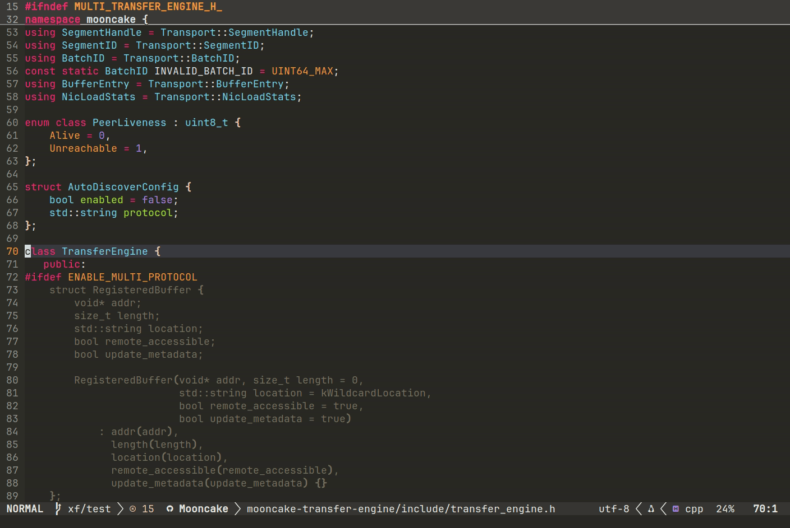
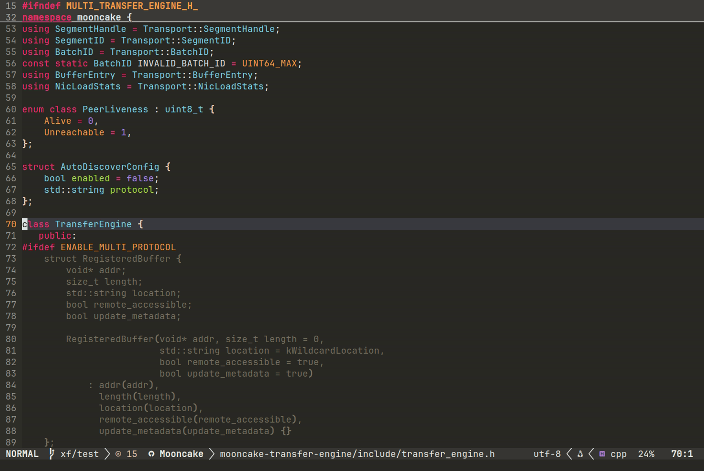
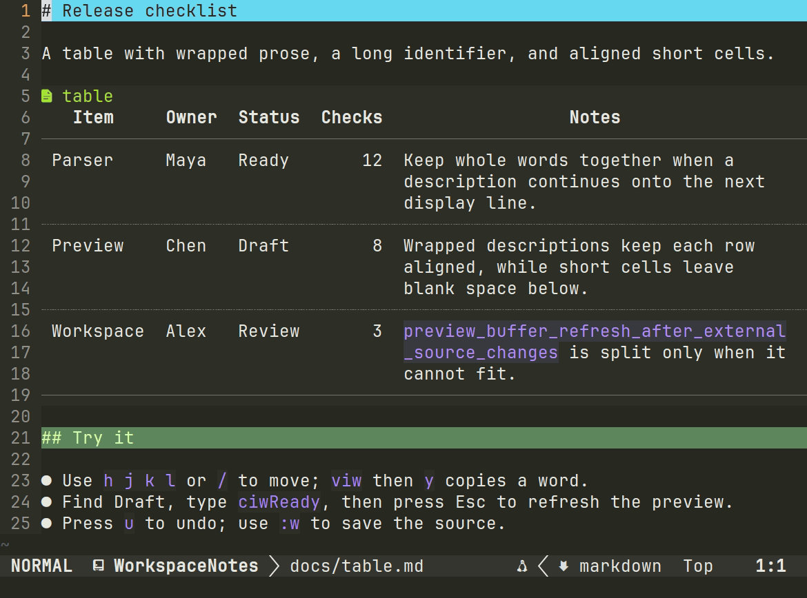
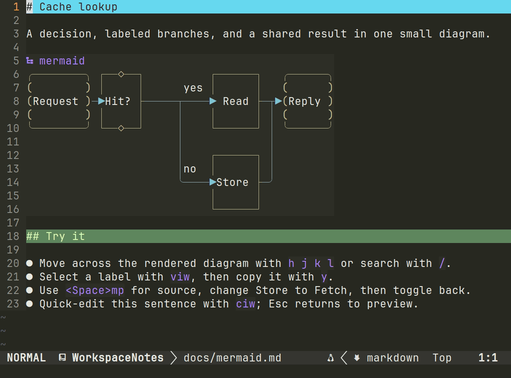
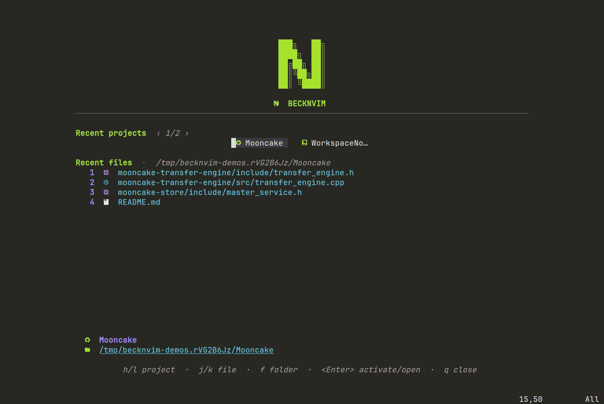

# BeckNvim

BeckNvim is a project-oriented Neovim configuration focused on navigation, semantic search, Git
inspection, language tooling, and readable code review. Its features share a consistent visual
system while keeping native Neovim and plugin behavior wherever practical.

## Features

- **Symbol search:** find functions and types across a project, explore source previews, and jump to definitions.
- **Visible text jumps:** use Flash labels with `<Space>s`; `<Space>fn` selects source syntax regions, including in rendered Markdown. `/` and `?` keep native whole-buffer search, directly in Markdown preview.
- **Git review:** explore merge-aware commit graphs, inspect branches and local changes, and resume repository reviews within a Neovim session. Search and guarded checkout work in both graph and detail views.
- **Markdown and Mermaid:** read tables and complex diagrams that adapt to the pane width, move through links without stepping through hidden URLs, and edit source in place. Press `<Space>mp` to render again after editing; external file changes refresh visible previews.
- **Project workspace:** browse recent projects and files from the homepage, with live [light and dark theme previews](themes/README.md).

## See it in action

**Symbol search:** project-wide function and type discovery across Mooncake.



**Git review:** search a remote branch, review a detached commit, and open a pull request in a float.



**Markdown tables:** long descriptions wrap at word boundaries, oversized identifiers split to fit,
and neighboring cells stay aligned. The full [table sample](examples/fixtures/project/docs/table.md)
fits on one page.



**Mermaid:** a [five-node flowchart](examples/fixtures/project/docs/mermaid.md) shows node shapes,
a decision, labeled branches, and a shared result on one page.



**Homepage and themes:** browse recent projects and files, then preview light and dark palettes.



See [Recording the highlights](examples/README.md) for demo generation, setup, and individual scenes.

## Main Modules

| Module | Main responsibility |
| --- | --- |
| `config/startup/` | Editor options, autocmds, keymap assembly, and plugin bootstrap |
| `config/project.lua` | Project-root discovery, activation, containment, and cached project state |
| `config/navigation.lua` | Shared file opens, launch context, pane selection, closing, and native jump navigation |
| `config/ui/` | Theme selection and palette, dashboard, file tree, statusline, terminal, shared floats, and window state |
| `config/search/` | Telescope configuration, project search, previews, and LSP location results |
| `config/git/` | Git history workflows, Diffview lifecycle, repository data, and GitHub details |
| `config/lsp/` | Language-server setup, completion, diagnostics, and type-information views |
| `config/syntax/` | Tree-sitter setup, Markdown rendering, folds, highlights, and syntax context |
| `config/type_hierarchy/` | Recursive class hierarchy and implementation discovery |
| `config/python/` | Python environment resolution and hierarchy indexing |
| `config/network/` | Proxy discovery, persistent session state, and proxy selection UI |
| `config/translation/` | Translation interface, provider construction, and response parsing |
| `config/audit/` | Project-wide diagnostic collection and audit coordination |
| `plugins/` | Plugin declarations, dependencies, loading conditions, and setup |

The complete ownership and lifecycle model is documented in
[Architecture](docs/architecture.md).

File-tree, terminal, file-search, and interactive `:e` opens share editor-pane selection: panel-origin opens
show a/b/c pane labels when several editors are available; editor-origin opens use the current pane.
Ordinary selection replaces that pane's view and preserves existing split proportions.
File and definition searches size their prompt, results, and preview across the full editor;
selecting a result replaces only the launch pane and preserves the split layout.
Replacing a file unlists its unused buffer. If the destination has unsaved edits,
a boundary extension asks whether to write it now (y/n); only a successful write permits replacement.
`<Space>o` / `<Space>p` retain native jump history across searches and file opens.
Local-file `gx` uses the same a/b/c chooser to replace an existing editor pane.
`<Space>ww` uses these badges to focus any existing pane, including the tree and terminal.
Ordinary tree selection replaces rendered Markdown in its existing pane; explicit split keys add panes.
For editor and tree splits, `:q` closes only the focused pane and leaves the other panes open.
`<Space>wq` closes the current pane while keeping its file buffer available; new splits use equal
sizes. Splits from the homepage restore editor line numbers and gutters when a file opens.
See [Default keybindings](docs/keybindings.md).

Persistent preferences use the replaceable SQLite backend through `config.state`; temporary settings
use the process-memory backend. SQLite-backed preferences share `~/.local/state/nvim/state.db`.
Log data lives in `~/.local/state/nvim/logs/` (or the corresponding XDG state directory).
Without SQLite, Neovim keeps running with preferences limited to the current process.

## Installation

Back up any existing `~/.config/nvim` directory, then run:

```bash
git clone https://github.com/BeckWlim/BeckNvim.git ~/.config/nvim
cd ~/.config/nvim
./setup.sh
```

Follow any PATH instructions printed by setup, reopen your terminal, and start Neovim:

```bash
nvim
```

On first launch, lazy.nvim installs missing plugins. Use `:Mason` to choose language servers.

Check dependencies and view setup options:

```bash
./setup.sh --check
./setup.sh --help
```

See the [installation guide](docs/installation.md) for dependencies, optional runtimes, parsers,
and troubleshooting check failures.

## Documentation

- [Installation details](docs/installation.md)
- [Default keybindings](docs/keybindings.md)
- [Git mode](docs/git-mode.md)
- [Architecture](docs/architecture.md)
- [Development and validation](docs/development.md)

## License

Licensed under the [MIT License](LICENSE).
