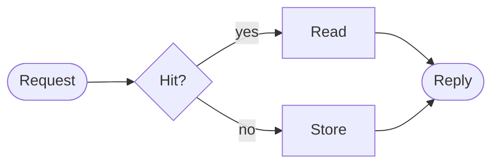

# Cache lookup

A decision, labeled branches, and a shared result in one small diagram.

## Try it

- Move across the rendered diagram with `h j k l` or search with `/`.
- Select a label with `viw`, then copy it with `y`.
- Use `<Space>mp` for source, change Store to Fetch, then toggle back.
- Quick-edit this sentence with `ciw`; Esc returns to preview.
